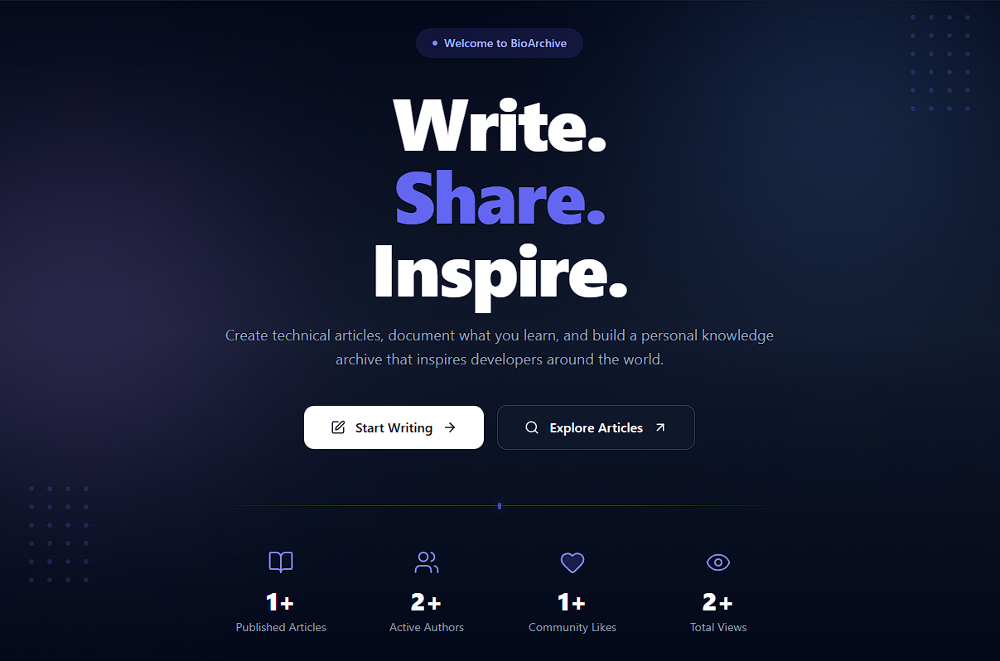
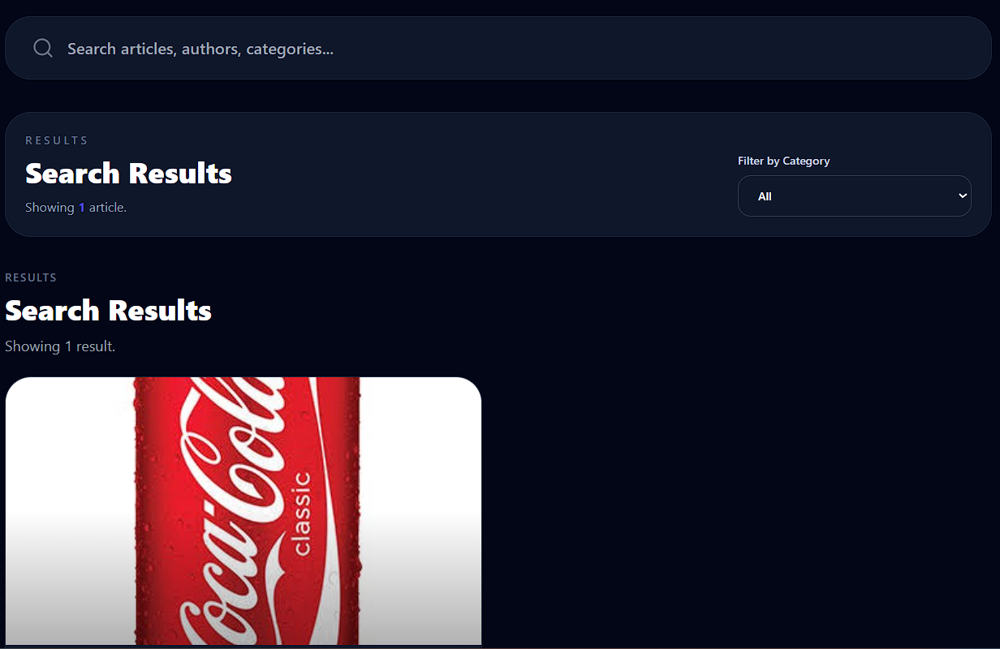
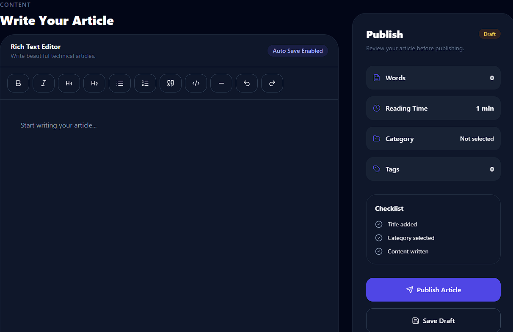
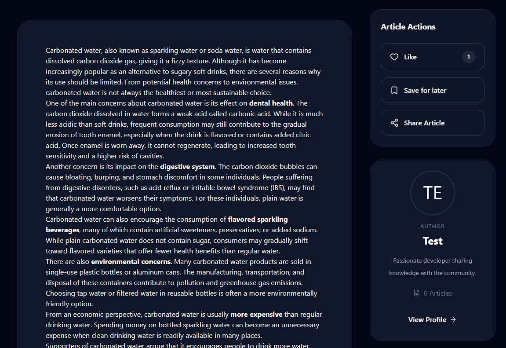
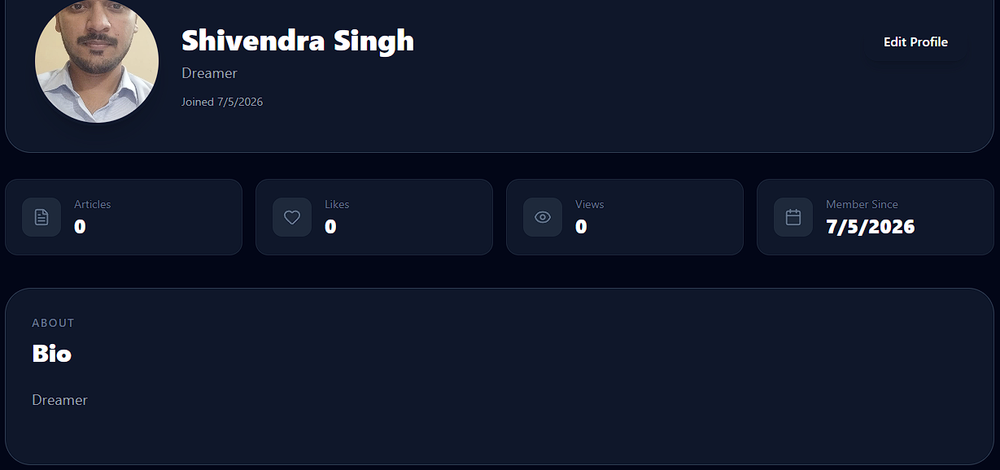
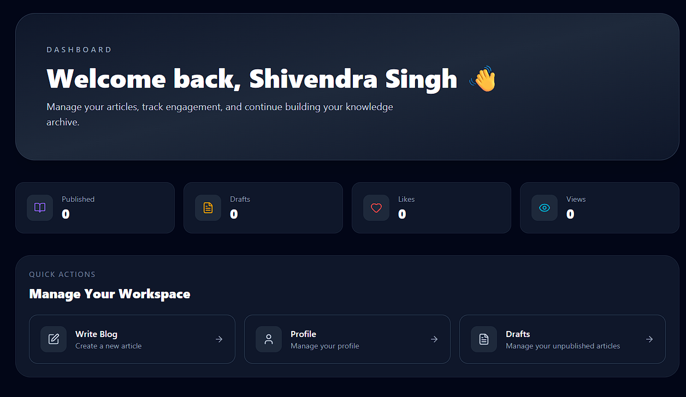
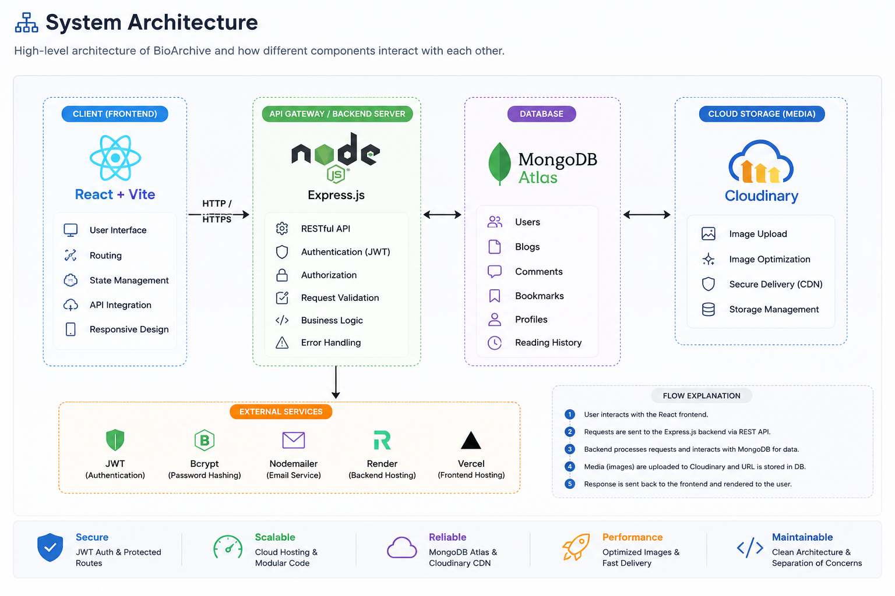

<p align="center">
  
</p>

<h1 align="center">📚 BioArchive</h1>

<p align="center">
Modern Full-Stack Blogging Platform
</p>

---

# ✨ Overview

BioArchive is a modern full-stack blogging platform where users can write, publish, discover, and manage articles through a clean and responsive interface.

The application focuses on delivering a professional blogging experience with secure authentication, rich text editing, Cloudinary-powered media uploads, user profiles, bookmarks, comments, and a personalized dashboard.

---


<div align="center">

## Live Demo

<a href="https://bioarchive-blog.vercel.app/" target="_blank">
    
</a>

<a href="https://bioarchive.onrender.com" target="_blank">
    
</a>

</div>

#  Key Features

| Feature | Status |
|----------|:------:|
| JWT Authentication | ✅ |
| User Profiles | ✅ |
| Rich Text Editor (TipTap) | ✅ |
| Blog Management | ✅ |
| Cloudinary Image Upload | ✅ |
| Dashboard | ✅ |
| Search Articles | ✅ |
| Category Filtering | ✅ |
| Comments | ✅ |
| Bookmarks | ✅ |
| Reading History | ✅ |
| Responsive Design | ✅ |
| Dark Mode | ✅ |

---
# 📸 Application Preview

<p align="center">

</p>

<p align="center"><b>🏠 Home Page</b></p>

---

<p align="center">

</p>

<p align="center"><b>🔍 Search Articles</b></p>

---

<p align="center">

</p>

<p align="center"><b>✍️ Rich Text Editor</b></p>

---

<p align="center">

</p>

<p align="center"><b>📖 Blog Details</b></p>

---

<p align="center">

</p>

<p align="center"><b>👤 User Profile</b></p>

---

<p align="center">

</p>

<p align="center"><b>📊 Dashboard</b></p>
# 🏗️ System Architecture

<p align="center">

</p>

## 🛠 Tech Stack

### Frontend


### Backend


### Deployment


# 📂 Project Structure

```text
BioArchive
│
├── client/
│   ├── src/
│   ├── public/
│   └── package.json
│
├── server/
│   ├── config/
│   ├── controllers/
│   ├── middleware/
│   ├── models/
│   ├── routes/
│   ├── utils/
│   └── server.js
│
└── README.md
```

---

# ⚙️ Local Installation

### Clone Repository

```bash
git clone https://github.com/Shivendr0309/BioArchive.git
```

### Install Dependencies

```bash
cd client
npm install

cd ../server
npm install
```

### Configure Environment Variables

Create a `.env` file inside the **server** directory.

```env
PORT=5000

MONGO_URI=YOUR_MONGODB_URI

JWT_SECRET=YOUR_SECRET

CLIENT_URL=

CLOUDINARY_CLOUD_NAME=YOUR_CLOUD_NAME

CLOUDINARY_API_KEY=YOUR_API_KEY

CLOUDINARY_API_SECRET=YOUR_API_SECRET
```

### Start Development Server

Backend

```bash
npm run dev
```

Frontend

```bash
npm run dev
```

---

# 📡 API Overview

| Method | Endpoint | Description |
|---------|----------|-------------|
| POST | `/api/auth/register` | Register User |
| POST | `/api/auth/login` | Login User |
| GET | `/api/blogs` | Fetch Blogs |
| POST | `/api/blogs` | Create Blog |
| PUT | `/api/blogs/:id` | Update Blog |
| DELETE | `/api/blogs/:id` | Delete Blog |
| PUT | `/api/profile` | Update Profile |

---

# 🎯 Roadmap

- ❤️ Persistent Likes
- 👥 Follow Authors
- 🔔 Notifications
- 📈 Article Analytics
- 🤖 AI-powered Article Summaries
- 🤖 AI-generated Tags
- 🌍 Multi-language Support

---

# 👨‍💻 Author

**Shivendra Singh**

GitHub

https://github.com/Shivendr0309

---

# ⭐ Support

If you enjoyed this project, consider giving it a **⭐** on GitHub.
